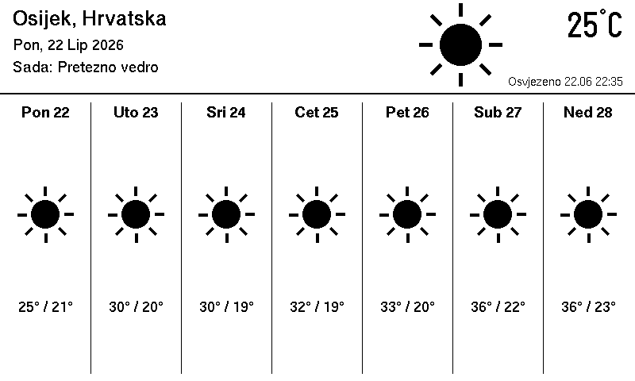

# eink — weekly weather on a Waveshare e-paper display

Renders a 7-day weather forecast to a **Waveshare 7.5" V2 (800×480) black/white**
e-paper panel on a **Raspberry Pi Zero W** — by drawing images directly, with no
Chromium / headless browser involved.

Weather comes from a selectable provider — [met.no](https://api.met.no/) (the
Norwegian Meteorological Institute, behind Yr.no; the default) or
[Open-Meteo](https://open-meteo.com/). Both are free and need no API key.



## How it works

The pipeline is `config → fetch → render → output`:

- **`config`** — TOML file (location, units, display, refresh).
- **`weather`** — Open-Meteo geocoding (shared) + a 7-day forecast over HTTPS
  (`ureq`) from the configured provider. met.no returns a UTC timeseries that is
  folded into local days using the geocoded IANA timezone (`chrono-tz`).
- **`render`** — draws an 800×480 1-bit framebuffer with `embedded-graphics`;
  text via `u8g2-fonts`, weather icons drawn as vector primitives.
- **`output`** — the rendered framebuffer goes to **either** a PNG (host preview)
  **or** the e-paper panel (`epd-waveshare` + `rppal` over SPI).

`render::draw` is generic over the draw target, so the *same* layout code feeds
the PNG and the panel. That also means you can iterate on the layout entirely on
your laptop — no Pi round-trip — and it leaves room to add a daemon + web config
UI later that reuses the exact same core.

## Build & preview on your PC

No hardware needed. The default (`preview`) feature renders to a PNG:

```sh
cargo run --bin render-once -- --config config.toml --output forecast.png
```

Run the tests:

```sh
cargo test
```

## Configuration

See [`config.toml`](config.toml):

```toml
provider = "met-no"       # met-no (Yr.no, default) | open-meteo

[location]
city = "Zagreb"
country = "HR"            # optional, disambiguates the geocoding hit

[units]
temperature = "celsius"   # celsius | fahrenheit
wind = "kmh"             # kmh | ms | mph | kn
precipitation = "mm"      # mm | inch

[display]
model = "epd7in5_v2"
rotation = 0              # 0 | 90 | 180 | 270
invert = true            # flip black/white if the panel renders inverted

[display.pins]            # standard Waveshare HAT wiring (BCM numbers)
reset = 17
dc = 25
busy = 24
power = 18               # PWR enable on newer HATs; 255 to disable

[refresh]
interval_minutes = 60     # how often the daemon re-fetches and re-renders

[health]
enabled = true            # expose a /health HTTP endpoint (on by default)
listen = "0.0.0.0:8080"   # address:port to bind
```

## Wiring (Waveshare 7.5" V2 HAT)

Uses SPI0 with hardware chip-select on CE0, plus three GPIOs:

| Panel | Pi (BCM) |
|-------|----------|
| DIN   | MOSI (GPIO10) |
| CLK   | SCLK (GPIO11) |
| CS    | CE0 (GPIO8)  |
| DC    | GPIO25 |
| RST   | GPIO17 |
| BUSY  | GPIO24 |

On the Pi, enable SPI once: `sudo raspi-config` → *Interface Options* → *SPI* →
enable, then reboot. The `pi` user must be in the `spi` and `gpio` groups
(default on Raspberry Pi OS).

## Cross-compile & deploy to the Pi Zero W

The Pi Zero W is ARMv6 hardfloat → target `arm-unknown-linux-gnueabihf`. The
most reliable cross toolchain is [`cross`](https://github.com/cross-rs/cross)
(Docker-based), which ships the C toolchain needed to build the TLS backend:

```sh
cargo install cross
PI_HOST=pi@raspberrypi-weather.home ./deploy/deploy.sh
```

`PI_HOST` defaults to `pi@raspberrypi-weather.home`; set it to override.

`deploy.sh` cross-builds the `device` binary, copies it plus `config.toml`,
and installs/enables the `eink-daemon` systemd service. An existing
`config.toml` on the device is left untouched by default; pass
`--overwrite-config` to replace it with the repo copy:

```sh
PI_HOST=pi@raspberrypi-weather.home ./deploy/deploy.sh --overwrite-config
```

If `[health] enabled = true`, `deploy.sh` also opens the configured port in
`ufw` when a firewall is active (a no-op on stock Raspberry Pi OS, which has none).

Watch the daemon (it logs every fetch/render/push):

```sh
ssh pi@raspberrypi-weather.home journalctl -u eink-daemon -f
```

Building directly on the Pi Zero W also works but is very slow (single-core
ARMv6): `cargo build --release --no-default-features --features device`.

## Daemon

The device deployment runs `eink-daemon`: it initialises the panel **once**,
then loops `fetch → render → push → sleep(interval)`. Keeping one process and a
single panel init avoids the deep-sleep/wake cycle that can hang the controller.
`deploy.sh` installs it as a `Type=simple` systemd service. Apply config changes
with `sudo systemctl restart eink-daemon`.

`render-once` is still available for host PNG previews and manual one-shot renders.

## Health endpoint

When `[health] enabled = true` (the default), the daemon serves a minimal
`GET /health` over plain HTTP on `[health] listen` (default `0.0.0.0:8080`) — no
HTTP framework, just a small std-only accept loop on a background thread.

It reports liveness based on the *last successful refresh*: a daemon stuck
retrying a failing fetch goes stale, which is the failure worth catching with an
external probe. It goes stale after ~2.5 refresh intervals (tolerates one missed
tick).

```sh
curl http://raspberrypi-weather.home:8080/health
# healthy:  200  {"status":"ok","last_success_age_s":15}
# stale:    503  {"status":"stale","last_success_age_s":4200}
```

## Roadmap

- [x] One-shot render → PNG preview (host)
- [x] Render → e-paper panel (device)
- [x] Long-running daemon driven by `interval_minutes`
- [x] `/health` liveness endpoint for external monitoring
- [ ] Web UI (`axum`) to edit config and preview the screen live — reuses
      `config` / `weather` / `render` / the daemon loop unchanged.
